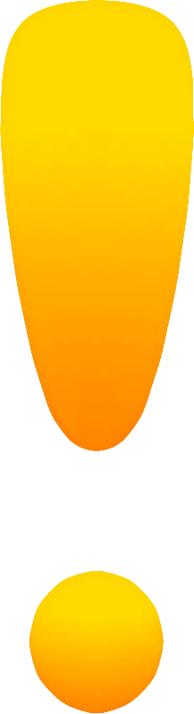

# Kayleigh's Random Task Chooser

## https://coletterbox.github.io/Random-Task-Chooser/

Hi, Kayleigh! :hearts:

The actual code for this project is essentially a copy of something else I made, so you can do whatever you want with this. As we discussed, you could just change the text and/or the colours for the purposes of practising using Git in a team. You could also swap all the tasks listed for things you like to do and change the colours for colours that you like, and try using it (just for fun - I know you've been super productive lately, and I doubt you actually need a tool for it). You could also do whatever you wanted with the functionality as a way to get a feel for what it's like to work with, modify and add to someone else's code. Or you could play with Markdown (btw - did you know Aaron Swartz helped create Markdown? I just found that out today). Whatever you feel like! :D

I'm adding you as a collaborator, and from there the process of cloning etc. will be pretty similar to what you've been doing with your own repos so far, and any differences will serve as good practice Googling stuff, but I am here if anything gets too tedious (because this is supposed to be fun!). :)

Have fun!!

